# You Too Can Animate: SVG Line Animation

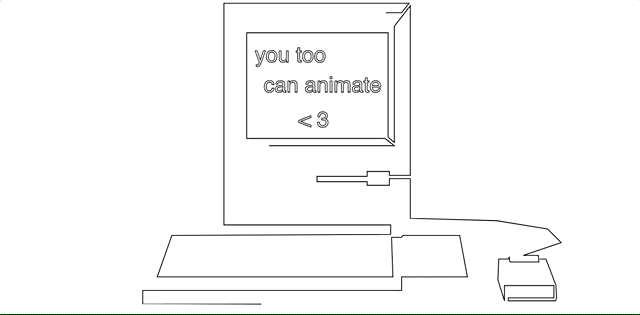

Animations are pleasing to look at and bolster usability within any application. Animations can provide important feedback and make users more patient. Animation makes interacting with a technology more fun and visually pleasing yet all too often, sites are static and feel inhuman. The focus of this post is not to make a case for adding animation to your next project, but to demonstrate how little the cost of doing so can be. Delighting your users might be easier than you think!

In this tutorial, you will create a custom SVG line-drawing and animate it with CSS keyframe animations.

## What you will need:
This tutorial uses three free web-based tools and requires no prior web-development, animation, or graphics editing experience.

### Vectr
[Vectr](https://vectr.com/) is an online vector graphics editor. It is free and has intuitive tools for drawing and exporting SVGs.

### SVGOMG
[SVGOMG](https://jakearchibald.github.io/svgomg/) is another free tool that takes an SVG file and strips away unnecessary code. This reduces the file size and eliminates code that may be distracting.

### CodePen
[CodePen](https://codepen.io/) is an online community and editor for writing and showcasing code. It is perfect for small animations. You can write code and see changes in real-time.

## What are SVGs?
SVGs or Scalable Vector Graphics are super. They are:
- vector images meaning they scale to any size without concern for resolution
- supported by all modern web browsers
- defined in XML which is a markup language that can be used within an HTML file.

In essence, an SVG file creates an image using xy-coordinates or "points". These points are grouped into “paths” which describe lines or shapes.


The path to describe the above triangle could look like this:
```xml
    <path d="M0 0 L100 0 L50 100 L5 10" />
```
**Don't fret, you will never need to write SVG paths by hand.** However, notice the number pairs following each `M` and `L`. These are x y coordinates marking each of the triangle's points along the path. Unlike raster image formats like JPEGs and PNGs, you won't see the pixels in enlarged SVGs. Increasing the image size simply increases the distance between points. No matter the size, SVG paths are filled smoothly.

In this tutorial you will create an SVG with a single path. However, SVGs often contain many paths to describe more complex images.

## Create your SVG

Head to [Vectr.com](https://vectr.com/) and click the 'Use Online' button to launch the web-based editor. No registration required! It will look something like this:

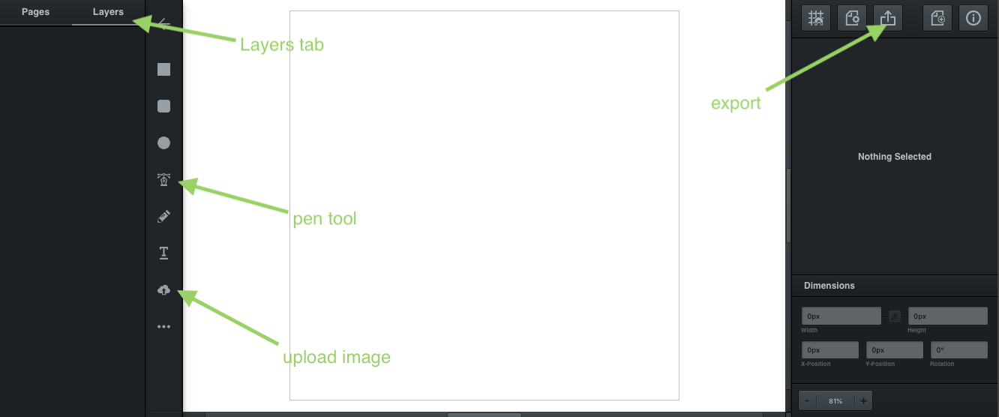

In the top left you can see the 'Layers' tab. If you are new to this type of software, you can think of layers as a stack of transparent sheets. Each layer can be edited individually without impacting the others. You will see a new layer in this column when you add a reference image and again when drawing a path.

Moving down, you will notice the pen tool. The pen tool creates a path by connecting points in a line. This is the tool used in this tutorial. The other tools create shapes or text which can also be exported as SVGs and animated.

Lower still is the upload image button.

Finally, once finished, you will export your SVG using the export button at the top of the right-side column.

### Upload an Image
Choose a reference image from your computer or find one online and download it. Keep it simple. Images with clear lines or high-contrast are best. It is difficult and tedious to express fine detail when drawing by hand. Use the upload button or drag-and-drop. Once uploaded, you will see an 'image' layer in the left column. Resize your image to fit the page by dragging any corner (**tip: hold shift to maintain the image's original aspect ratio**)

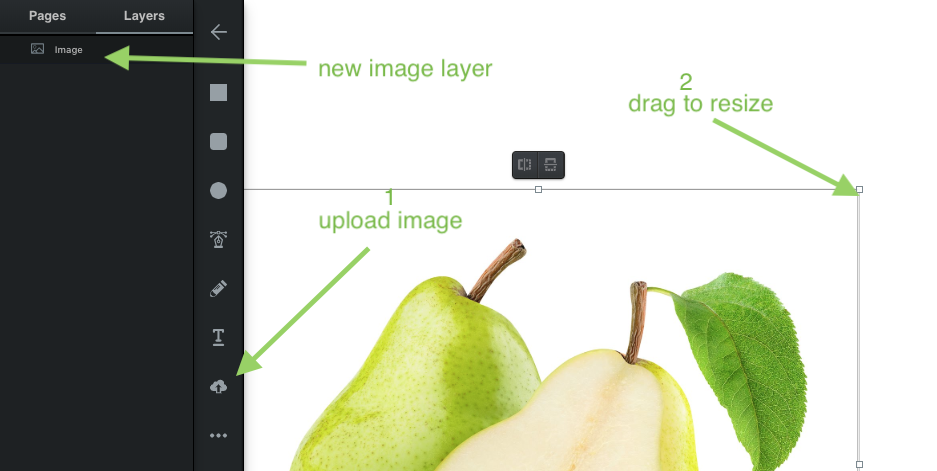

### Sketch Your Path

Sketch. Meaning do this step quickly and loosely. It is easy to add, remove, and tweak points along your path later. A rough path at this stage allows you to experiment and make changes quickly. Click the pen tool then click any location on your image to start a path. Each following click adds a new point and extends your path.

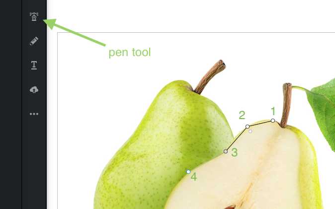

Continue adding points along the major lines of your reference image. It may take a few tries to capture your image with a single path. The delete key will remove the last point in your path. You can also drag existing points if you need to reposition.

You may want to hide the reference image to get a better idea of what your finished SVG will look like. Hover over your image layer and click the eye icon to toggle that layer's visibility.

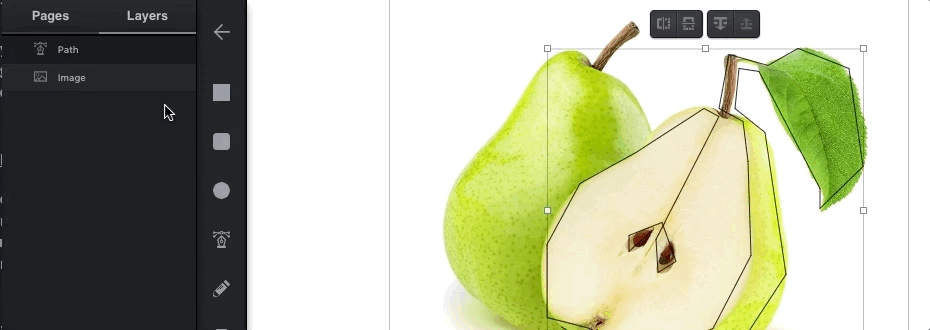

### Refine Your Path

There are several basic ways to edit a path to better fit an image:
- Reposition a point - drag any existing point
- Add a new point - click anywhere along your existing path
- Remove a point - click any existing point to select it and then press the delete key


You may have noticed small circles or "corner widgets" next to each point in your path. These widgets adjust the curvature of points. Drag the widget away from its point to soften the curve.

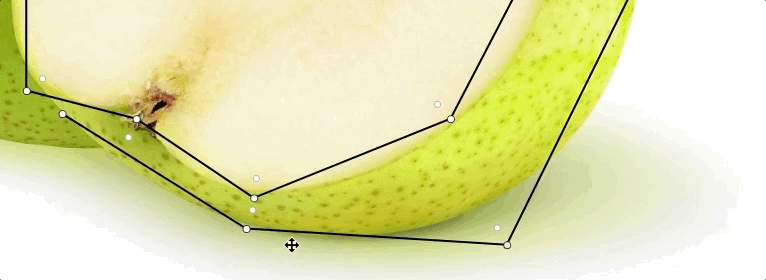

Double clicking a point toggles between two methods for adjusting a curve. Play with both!


#### A Few Tips
- Don't sweat the small stuff - illustration is about conveying more with less. It is impossible to capture every detail so be selective about which elements to express. Try removing points to simplify your path.
- You don't get points for realism - hide your reference image. Experiment with proportions and the intensity of curves to give your illustration style.

### Export Your SVG
Once satisfied with your path, it is time to export! First, click the path layer to select it for export. You do not want your reference image included in the exported file. You will see a grey rectangle surrounding only the path. Then click the export button.

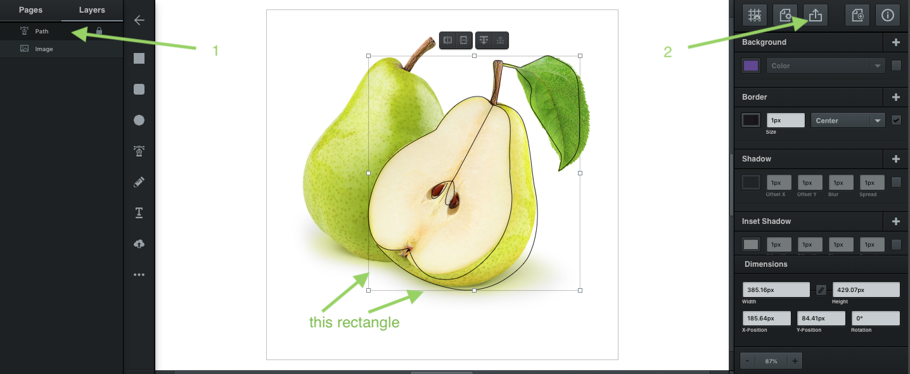

On the export page, select 'selection' and double check that you **do not** see your reference image behind your path. Then click download to save your SVG!

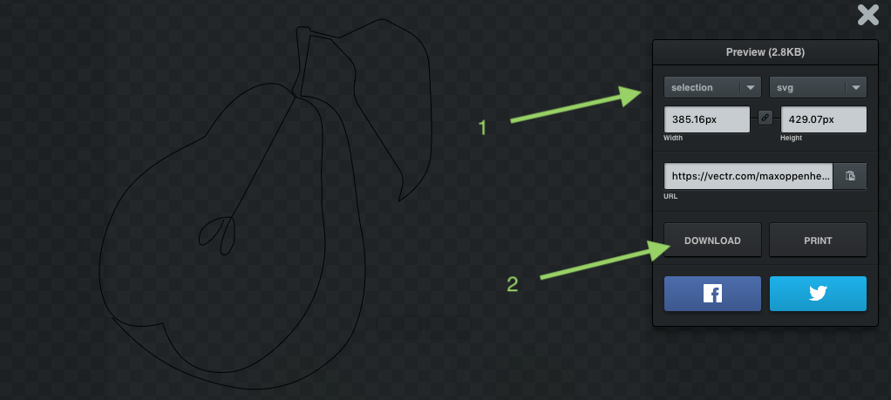

## Clean Your SVG
SVG cleaners do a few helpful things. Cleaners remove unnecessary code and expose nicely formatted XML code used in the next step.

Navigate to [SVGOMG](https://jakearchibald.github.io/svgomg/) and upload the SVG file downloaded from Vectr (it is likely in your downloads folder entitled 'untitled.svg')

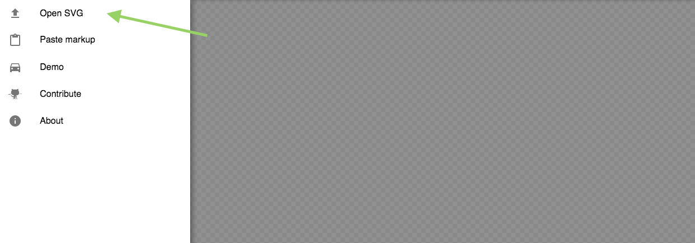

After uploading, you will see a column of switches on the right hand side. Leave the default settings as-is and click the 'copy as text' button just below the paint bucket. You will paste this text in the next step.

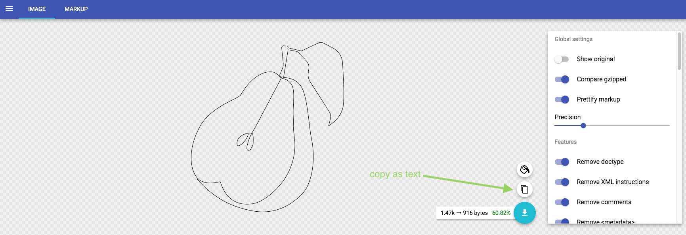

## Animate!

Navigate to [CodePen](https://codepen.io/) and create a new "Pen", an editor where you will write a little code to animate your SVG.

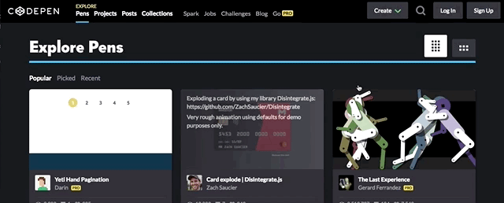

In the new editor you'll notice three text areas at the top with the headings 'HTML', 'CSS', and 'JS'. Hypertext Markup Language, Cascading Style Sheets, and JavaScript are standard languages used to create web pages and applications. HTML describes the content and structure of a webpage and CSS describes the style or presentation of that HTML. Ignore the JS section for this tutorial.

### HTML

Paste the SVG code copied from [SVGOMG](https://jakearchibald.github.io/svgomg/) into the HTML area, this is the content you will animate with CSS. Your SVG will appear in the white area below.

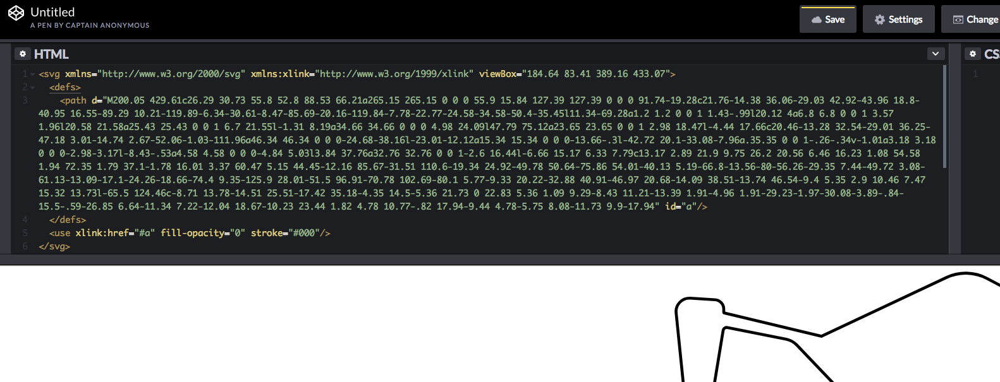

**Do not** edit this HTML code but notice its structure. At the top and bottom you can see `<svg {don't worry about the junk in here}>` and `</svg>`. These are called "open" and "close tags". They denote the beginning and end of an HTML element, in this case, an SVG. HTML elements can be nested, meaning they can contain other elements. Everything between the open and close SVG tags are parts of your SVG. You should recognize the enclosed `path` tag. The path tag looks a little bit different `<path d="{your path coordinates}" />`.  It does not contain any other HTML elements, so it is "self closing".

### CSS

Now you can use CSS to describe the `svg` and `path` HTML elements. CSS code follows the following syntax:

```CSS
selector {
  property: value;
}
```

A `selector` is an HTML element to be targeted. A `property` is a quality of the element that can be modified, and a `value` specifies how that quality should look or behave. A CSS document can have many selectors and selectors can have many property/value pairs. To demonstrate, paste the following code into the CodePen CSS area.

```CSS
svg {
  height: 100vh;
  width: 100vw;
  background-color: BurlyWood;
}
```

The `svg` CSS selector targets the entire `svg` HTML element. The height and width of your svg should have changed to fill the entire window below your code. The values `100vh` and `100vw` specify that the SVG's height and width should be 100% of the view height and view width respectively. If you resize the display area or your browser window, the SVG will resize to match. A height of `50vh` would specify half of the window's height. Your SVG also has a fun new background color! You can choose your own from a complete list of named CSS colors [here](https://css-tricks.com/snippets/css/named-colors-and-hex-equivalents/).

Next, target the `path` element. On a new line, paste the following code after the `svg` selector's closing bracket ( `}` ) :

```CSS
path {
  stroke-dasharray: 100;
}
```

A "stroke" is the line that follows a path. Until now, the path has been drawn with a solid stroke, meaning a single continuous line. The `stroke-dasharray` property makes a stroke dashed and its value specifies the length of each dash.

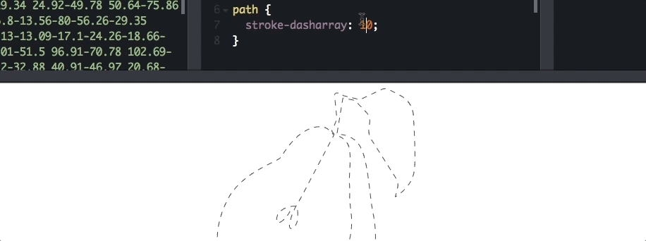

Next, define the animation. Paste the following keyframe definition on a new line in the CSS area. You will not see any change to the SVG just yet.

```CSS
@keyframes draw {
  from {
    stroke-dashoffset: 0
  }
  to {
    stroke-dashoffset: 200;
  }
}
```

`@keyframes` is an "at-rule" or a CSS keyword that describes a behavior. This one describes steps in an animation. The following word, 'draw', is the name and is used later to reference this animation. You can name the animation anything you like. `from` and `to` are keyframe selectors to specify what the animation will look like at its beginning and end.

This keyframe definition describes a gradual change in the `stroke-dashoffset` property. It specifies start and end values; CSS keyframes can fill in the rest. The `stroke-dashoffset` property describes where along the path the stroke starts. Its value specifies the distance from the beginning of the path.

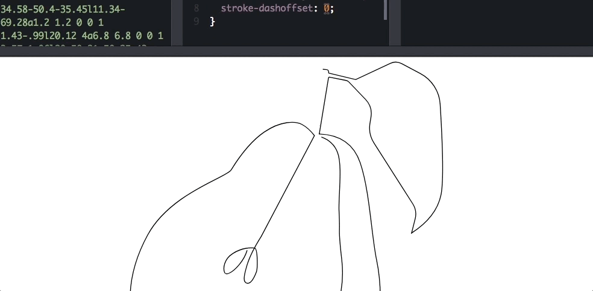

Finally, it is time to apply the animation. Add `animation: draw 2s infinite` inside your `path` css selector. The animation property can take several values. This example receives `draw` the name of the keyframe animation, `2s` the duration of the animation in seconds, and `infinite` a keyword specifying that the animation should repeat indefinitely. Your complete CSS should look something like this:

```CSS
svg {
  height: 100vh;
  width: 100vw;
  background-color: white;
}

path {
  stroke-dasharray: 100;
  animation: draw 2s infinite;
}

@keyframes draw {
  from {
    stroke-dashoffset: 0
  }
  to {
    stroke-dashoffset: 200;
  }
}
```

Once your SVG is in motion, experiment with the `stroke-dasharray`, and `stroke-dashoffset` values to find a dash length that suits your image. For a smooth animation, ensure your 'to' `stroke-dashoffset` value is a multiple of the `stroke-dasharray` value (at least double).

All of the CSS properties used in this tutorial can take a variety of values. Combinations of which can change the effect of your animation greatly.

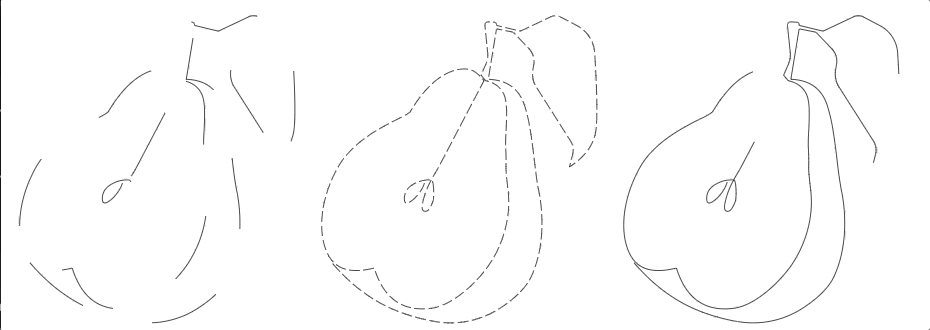
Check out the [example codepen](https://codepen.io/OppNHeimer/pen/EeBzMw)

In particular, read into [animation](https://developer.mozilla.org/en-US/docs/Web/CSS/animation), [stroke-dasharray](https://developer.mozilla.org/en-US/docs/Web/SVG/Attribute/stroke-dasharray), and [@keyframes](https://developer.mozilla.org/en-US/docs/Web/CSS/@keyframes) to customize your animation further.

Now you have the tools to build an animated SVG line drawing. Add a little motion to your next project!

